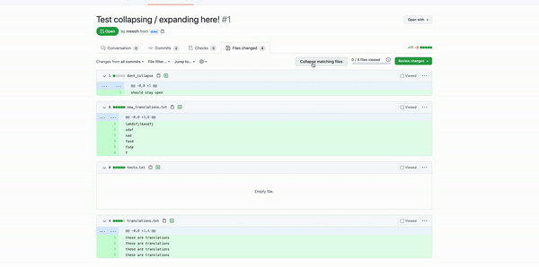

# Translation-Collapser

Tiny chrome extension to collapse files in githubs file-view while reviewing a PR. As of now, it injects a collapse/expand button, and only collapses/expands files that have the word 'translations' in the filename.

TODO:
- Add an options page where the user can predefine keywords that should get collapsed on button press

